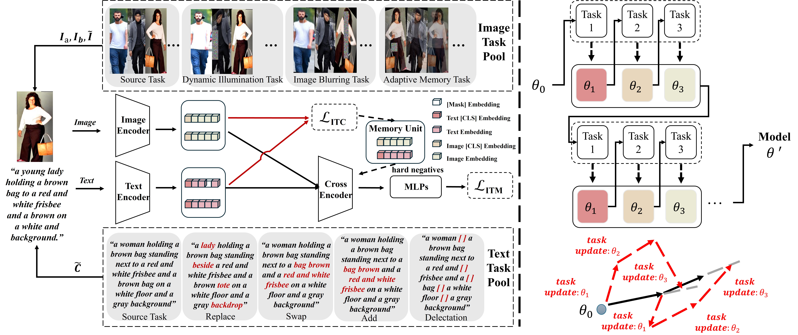

# CAMeL: Cross modality Adaptive Meta Learning for Text based Person Retrieval
[IEEE Transactions on Information Forensics and Security'25] Pytorch implementation of CAMeL: Cross-modality Adaptive Meta-Learning for Text-based Person Retrieval.

**More details can be found at our paper: [CAMeL: Cross modality Adaptive Meta Learning for Text based Person Retrieval](https://ieeexplore.ieee.org/document/10980229)**

<div align="center"></div>

## News
* The CAMeL is released. Welcome to communicate！
* The checkpoints have been released at [Baidu Yun]([http://example.com](https://pan.baidu.com/s/1lp0MyThgf7Shdv3PH2_tig?pwd=tq35 )[tq35]！


## Models and Weights

The checkpoints will comming soon.

## Usage

### Install Requirements

we use 4 A6000 48G GPU for training and evaluation.

Create conda environment.

```
conda create -n camel python=3.8
conda activate camel
pip install torch==1.9.1+cu111 torchvision==0.10.1+cu111 torchaudio==0.9.1 -f https://download.pytorch.org/whl/torch_stable.html
pip3 install -r requirements.txt
```

### Datasets Prepare

Download the CUHK-PEDES dataset from [here](https://github.com/ShuangLI59/Person-Search-with-Natural-Language-Description) , the RSTPReid dataset from [here](https://github.com/NjtechCVLab/RSTPReid-Dataset), and ICFG-PEDES dataset from [here](https://github.com/zifyloo/SSAN).

Download the processed json files of the aboves three datasets will comming soon.

Download pre-trained models for parameter initialization:

image encoder: [sg-transformer](https://github.com/OliverRensu/SG-Former)

text encoder: [bert-base](https://huggingface.co/bert-base-uncased/tree/main)

Organize `data` folder as follows:

```
|-- data/
|    |-- bert-base-uncased/
|    |-- finetune/
|        |-- gene_attrs/
|            |-- g_4x_attrs.json
|            |-- g_c_g_a_0_attrs.json
|            |-- ...
|        |-- cuhk_train.json
|        |-- ...
|        |-- icfg_train.json
|        |-- ...
|        |-- rstp_train.json
|        |-- ...
|    |-- SG-Former-S.pth
```

And organize those datasets in `images` folder as follows:

```
|-- images/
|    |-- <CUHK-PEDES>/
|        |-- imgs/
|            |-- cam_a/
|            |-- cam_b/
|            |-- ...
|            |-- train_query/
|            |-- gene_crop/
|                |-- 4x/
|                |-- c_g_a/
|                |-- ...
|                |-- i_g_a_43/
|
|    |-- <ICFG-PEDES>/
|        |-- test/
|        |-- train/
|
|    |-- <RSTPReid>/
```

### Pretraining
We pretrain our CAMeL using MALS as follows：

```
python3 run.py --task "itr_gene" --dist "f4" --output_dir "output/pretrained"
```

### Fine-tuning
We fine-tune our CAMeL using existing text-based Person Reid datasets. Performance can be improved by replacing the backbone with our pre-trained model. Taking CUHK-PEDES as example:

```
python3 run.py --task "itr_cuhk" --dist "f4" --output_dir "output/ft_cuhk" --checkpoint "output/pretrained/checkpoint_31.pth"
```

### Evaluation

```
python3 run.py --task "itr_cuhk" --evaluate --dist "f4" --output_dir "output/ft_cuhk/test" --checkpoint "output/ft_cuhk/checkpoint_best.pth"
```

## Reference
If you use CAMeL in your research, please cite it by the following BibTeX entry:

```bibtex

@article{yu2025camel,
  title={CAMeL: Cross-modality Adaptive Meta-Learning for Text-based Person Retrieval},
  author={Yu, Hang and Wen, Jiahao and Zheng, Zhedong},
  journal={IEEE Transactions on Information Forensics and Security},
  year={2025},
  publisher={IEEE}
}

@inproceedings{yang2023towards,
  title={Towards Unified Text-based Person Retrieval: A Large-scale Multi-Attribute and Language Search Benchmark},
  author={Yang, Shuyu and Zhou, Yinan and Wang, Yaxiong and Wu, Yujiao and Zhu, Li and Zheng, Zhedong},
  booktitle = {Proceedings of the 2023 {ACM} on Multimedia Conference},
  year={2023}
}


```

